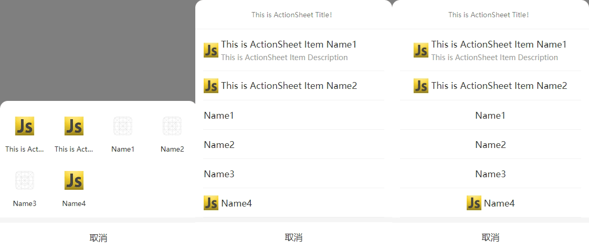

# @shawyu/actionsheet

actionsheet.js 是一款轻量的`JavaScript`和`Node.js`插件。不依赖任何第三方库。
是一款响应式插件，在移动端和PC端都有很好的展示效果！

zh_CN [简体中文](README.md)

en [English](README_en.md)



[Github地址](https://github.com/shawyuu/js-plugin/tree/main/actionSheet)

```
https://github.com/shawyuu/js-plugin/tree/main/actionSheet
```

## 开始使用

### npm安装

```sh
npm install @shawyu/actionsheet
```

### 普通引入

```
<script src="../actionsheet/index.js"></script>
```

### 使用

```js
import ActionSheet from '@shawyu/actionsheet'

ActionSheet.show({
	title: 'ActionSheet Title',
	itemList: ['A', 'B', 'C'],
	success: (res) => {
		console.log(res)
	},
	fail: (err) => {
		console.log(err)
	}
})
```

所有属性设置

```js
ActionSheet.show({
	title: 'ActionSheet Title',/*标题名称*/
	size:16,/*标题字体大小*/
	bold:true, /*标题加粗*/
	align:"center", /*center、left,当网格为false时生效*/
	closeText:"取消",
	grid:false,
	itemList: ['A', 'B', 'C'],
	itemColor:'#f00',
	itemSize:15, /*当网格为false时生效*/
	success: (res) => {
		console.log(res)
	},
	fail: (err) => {
		console.log(err)
	}
})
```

数组中的项目可以混合使用。您可以将特定项目单独设置为对象。如果对象包含“color”或“font”属性，则当前项目的“color”和“font”将根据对象的设置进行设置，优先级高于“itemColor”和“itemSize”。

```js
ActionSheet.show({
	itemList: [{name:'A',desc:'this is A',color:'#0f0',size:16}, 'B', 'C'],
	itemColor:'#f00', /* 第一项的此值将无效，其颜色将显示为“#0f0”。 */
	itemSize:15, /* 第一个项目的值将无效，其字体大小将显示为16px。 */
	success: (res) => {
		console.log(res)
	},
	fail: (err) => {
		console.log(err)
	}
})
```

### 所有属性

|属性|类型|默认值|必需|描述|
|:-:|:-:|:-:|:-:|:-:|
|title|`string`| `""` | `NO` |ActionSheet标题名称|
|size|`string\|number`| `13` | `NO` |标题的字体大小.|
|bold|`boolean`| `false` | `NO` | 确定标题的字体大小是否为粗体. |
|grid|`boolean`| `false` | `NO` | ActionSheet是否展示为网格样式.)|
|align|`string`| `center` | `NO` | itemList的对齐方法。当网格为false时生效，可能的值：`center`、`left`）|
|itemList|`Array.<string\|number\|object>`| `[]` |`YES` | ActionSheet项目`Array.<object> object{name:string,desc:string,color:string,size:string|number,icon:string}`. 当网格为false时 `desc`无效|
|itemColor|`string`| `#333` |`NO` | 所有itemList文本标题(`name`)的字体颜色，优先级低于itemList（`Array.<object>`的`color`）|
|itemSize|`string\|number`| `17` | `NO` | 所有itemList文本标题(`name`)的字体大小，当网格为false时生效。优先级低于itemList（`Array.<object>`的`size`）|
|closeText|`string`| `取消` | `NO` | 取消文本 |
|success|`function`| | `NO` |点击列表项后的回调函数 |
|fail|`function`|  | `NO` |点击取消或遮罩后的回调函数 |

### itemList 说明

|类型|说明|举例|
|:-:|:-:|:-:|
|`Array.<string>`|`string`| ['A','B','C'] |
|`Array.<number>`|`number`| [1,2,3] |
|`Array.<object>`|`{name:'',desc:'',color:'',size:'',icon:''}`| [{name:'A',desc:'this is A',color:'#f00',size:16,icon:''}] |

### 版本日志

>
> 1.0.2  修复初始化重复样式\
> 1.0.3  添加网格样式、取消文本配置和文本对齐方式\
> 1.0.5  修复文档问题\
> 1.0.6  修复已知问题\
> 1.0.7  优化
>
