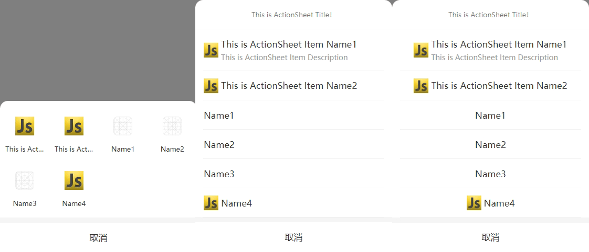

# @shawyu/actionsheet

actionsheet.js is a lightweight plugin for JavaScript and Node.js. 

zh_CN [简体中文](README.md)

en [English](README_en.md)



## Getting started

### Install

```sh
npm install @shawyu/actionsheet
```

### In browser

```sh
<script src="../actionsheet/index.js"></script>
```

### Usage

```js
import ActionSheet from '@shawyu/actionsheet'

ActionSheet.show({
	title: 'ActionSheet Title',
	itemList: ['A', 'B', 'C'],
	success: (res) => {
		console.log(res)
	},
	fail: (err) => {
		console.log(err)
	}
})
```

When set all Props!

```js
ActionSheet.show({
	title: 'ActionSheet Title',
	size:16,
	bold:true,
	itemList: ['A', 'B', 'C'],
	itemColor:'#f00',
	itemSize:15,
	success: (res) => {
		console.log(res)
	},
	fail: (err) => {
		console.log(err)
	}
})
```

The items in the array can be mixed and used together. You can set a specific item as an object separately. If the object contains `color` or `font` attributes, the current item's `color` and `font` will be set based on the object's settings, with priority over `itemColor` and `itemSize`.

```js
ActionSheet.show({
	itemList: [{name:'A',desc:'this is A',color:'#0f0',size:16}, 'B', 'C'],
	itemColor:'#f00', /* This value of first item will become invalid ，Its color will appear as '#0f0'. */
	itemSize:15, /* This value of first item will become invalid ，Its fontSize will appear as 16px. */
	success: (res) => {
		console.log(res)
	},
	fail: (err) => {
		console.log(err)
	}
})
```

### All Props

|PROP|TYPE|DEFAULT|REQUIRED|DESCRIPTION|
|:-:|:-:|:-:|:-:|:-:|
|title|`string`| `""` | `NO` |The title of the actionSheet.  |
|size|`string\|number`| `13` | `NO` |The fontSize of title.|
|bold|`boolean`| `false` | `NO` | Determines if the fontSize of title is bold. |
|grid|`boolean`| `false` | `NO` | Determines if the style of actionSheet is grid.)|
|align|`string`| `center` | `NO` | The alignment method of item. When the grid is false,it takes effect,Possible values:`center`、`left`)|
|itemList|`Array.<string\|number\|object>`| `[]` |`YES` | Items of the actionSheet. |
|itemColor|`string`| `#333` |`NO` | The text color of item, with lower priority than itemList(`Array.<object>`)|
|itemSize|`string\|number`| `17` | `NO` | The fontSize of item, When the grid is false,it takes effect. with lower priority than itemList(`Array.<object>`)|
|closeText|`string`| `取消` | `NO` | The close text of actionSheet.|
|success|`function`| | `NO` |Callback function after clicking on a list item |
|fail|`function`|  | `NO` |Callback function after clicking on cancel or mask |

### itemList construction

|TYPE|CONSTRUCTION|EXAMPLE|
|:-:|:-:|:-:|
|`Array.<string>`|`string`| ['A','B','C'] |
|`Array.<number>`|`number`| [1,2,3] |
|`Array.<object>`|`{name:'',desc:'',color:'',size:'',icon:''}`| [{name:'A',desc:'this is A',color:'#f00',size:16,icon:''}] |

### Logs

> 1.0.2  Fix initialization duplicate styles
> 
> 1.0.3  Add grid、closeText and alignment method
>
> 1.0.5  Fix document problems
